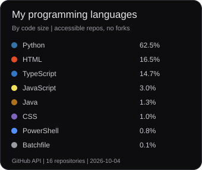
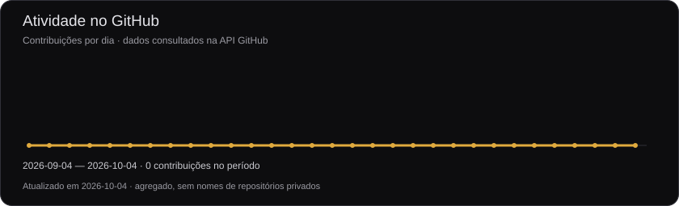
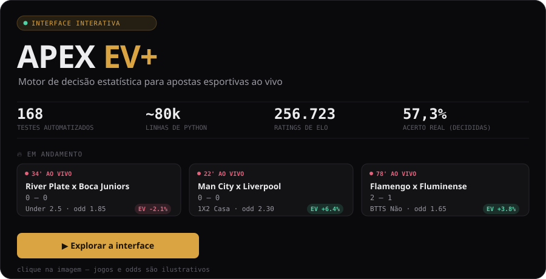

# 🧑🏾‍💻 Jonas Henrique

* HTML e CSS: Para estruturar e estilizar páginas web.
* JavaScript e React: Para criar interfaces dinâmicas e interativas.
* Node.js e Git/GitHub: Para entender o funcionamento do back-end e para versionamento de código.
* Python, SQL e Java: explorando automação, dados e aplicações desktop em projetos pessoais e acadêmicos.
* TypeScript, Electron e PowerShell: aplicativo Windows para organizar canais e sessões TikTok.

 

### 🚀 Projetos em destaque

* 🔒 **APEX EV+** *(privado)* — motor de decisão estatística para apostas esportivas ao vivo, em Python/PyQt6. → [Ver a interface](https://hj0nstep.github.io/apex-ev-interface/)
* **[sistema-leiloes](https://github.com/Hj0nstep/sistema-leiloes)** — sistema de leilões em Java (Swing/JDBC), projeto acadêmico (SENAC).
* **[Projeto-Integrado-II-InfoTechG](https://github.com/Hj0nstep/Projeto-Integrado-II-InfoTechG)** — sistema de gestão para loja de assistência técnica, Java (SENAC).

 

### 🤖 Linguagens e Tecnologias

 

### 📊 Estatísticas

 

 

Gráfico de atividade servido pelo próprio repositório. Contador dinâmico Visitor Badge: requisições da imagem, não pessoas únicas; histórico independente do antigo Komarev.

